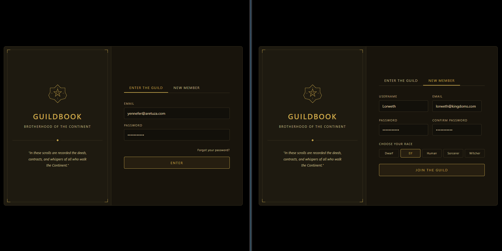
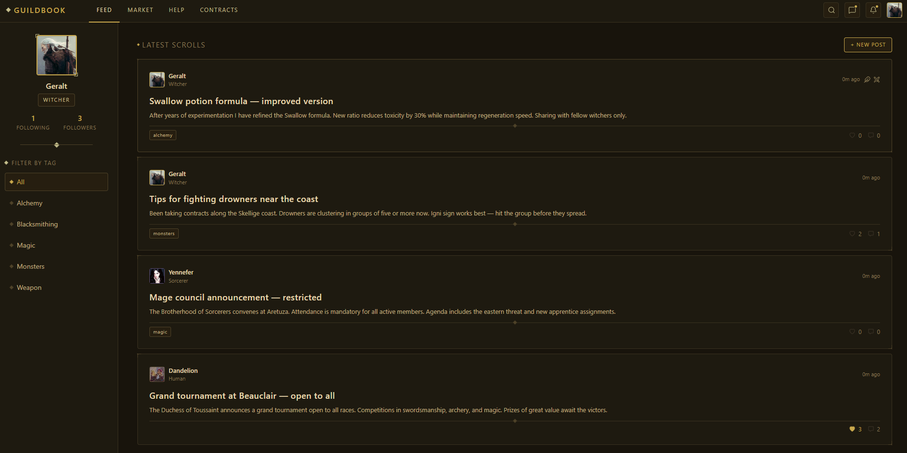
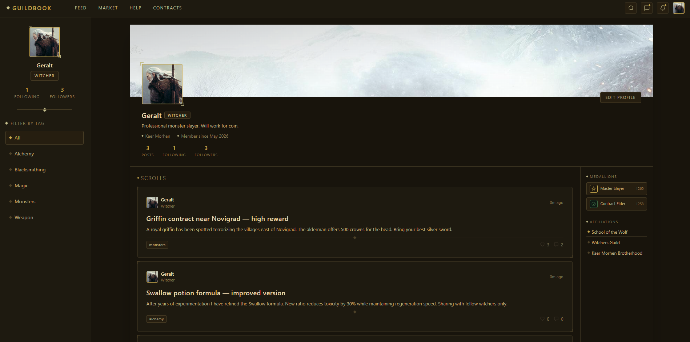

# Guildbook - Fantasy Social Network


<br>

A full-stack fantasy social platform — built like a guild network, styled after the world of The Witcher. Built with **FastAPI** and **React**.  
The system features real-time interactions, a dynamic feed, and a unique role-based access control system where content visibility depends on the user's in-game race (e.g., restricted market offers).

**Built solo** as a personal project to push into new territory: WebSockets, Server-Sent Events, and auth from scratch for the first time.

<br>

## Live Demo
Check out the live version of the project: [GuildBook Live](https://guildbook-front.vercel.app)

> **Note:** The backend is hosted on a free tier, so it may take **30-50 seconds** to wake up on the first load. If the page doesn't load immediately, please wait a moment!

### Test Credentials
 
Use these accounts to test real-time interactions and race-based permissions:
 
| | Email | Password |
|---|---|---|
| User 1 (Human) | geralt@kaermorhen.com | password123 |
| User 2 (Mage) | yennefer@aretuza.com | password123 |

<br>

## Features
- **Feed** - Browse posts across different categories
- **Profiles** - User profiles with race, follower/following counts, and post history
- **Follow system** - Follow/unfollow members with optimistic UI updates
- **Likes** - Like and unlike posts with instant feedback
- **Real-time notifications** - Live notification dropdown via SSE
- **Messaging** - Real-time direct messages between guild members via WebSockets
- **Authentication** - Full register/login flow with JWT-based auth
- **Post creation** - Write and publish new scrolls to the feed
- **Post detail & comments** - Thread-style discussion on each post
- **Tag filtering** - Sidebar tag filter synced across feed and profile pages

<br>

## Screenshots



<br>

## Running with Docker
 
**Prerequisites:** Docker and Docker Compose must be installed.
 
1. Clone the repository:
```bash
git clone https://github.com/Wikuska/GuildBook.git
cd guildbook
```
 
2. Start the application:
```bash
docker-compose up -d --build
```
 
This will spin up the frontend, backend, and database - and seed the database with sample guild members, posts, and tags automatically.
 
3. Access the app:
```
Frontend UI:           http://localhost:5173
Backend API (Swagger): http://localhost:8000/docs
```
 
4. Clean up:
```bash
docker-compose down -v
```


## Tech Stack

- **Backend:** Python 3.11, FastAPI, Uvicorn, Pydantic, Pytest
- **Database & ORM:** PostgreSQL 15, SQLAlchemy 2.0, Alembic, Psycopg2
- **Real-Time & Caching:** Redis, WebSockets, Server-Sent Events (SSE)
- **Security & Authentication:** JWT, Argon2, python-jose, pwdlib
- **Frontend:** React 18, Vite, React Router v6, Zustand, Tailwind CSS, TanStack Query
- **Infrastructure:** Docker, Docker Compose, Nginx
